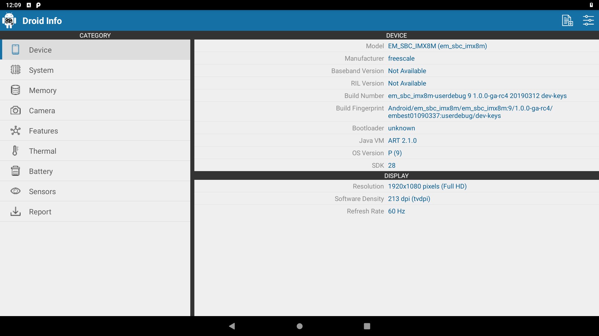
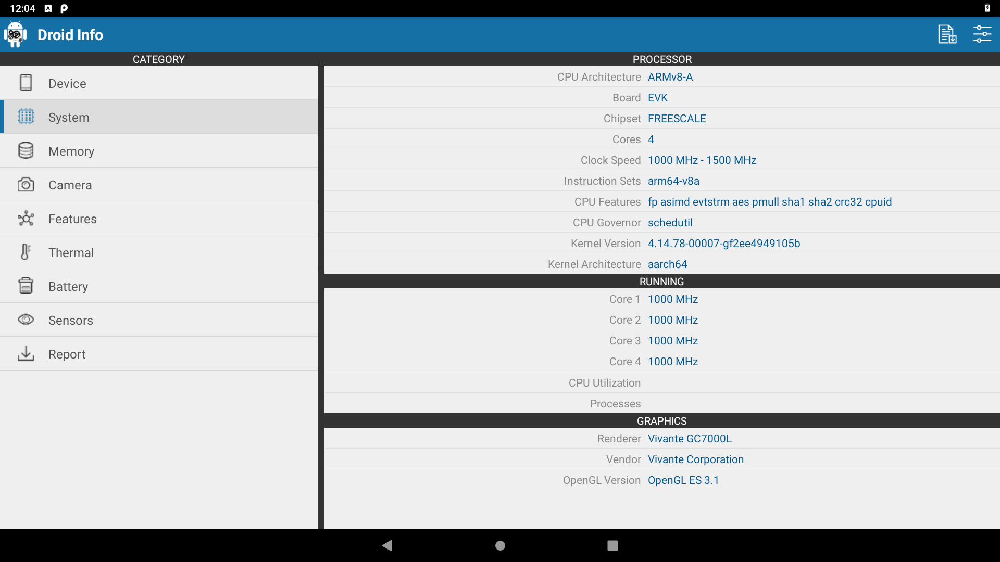
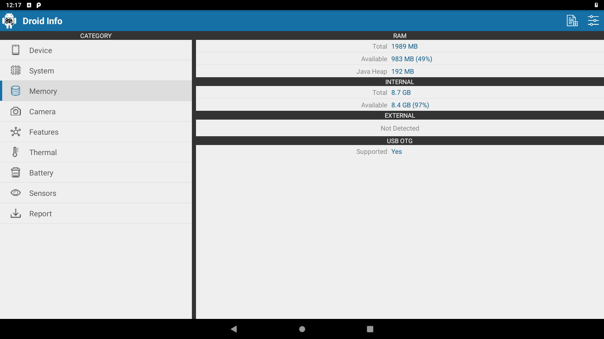
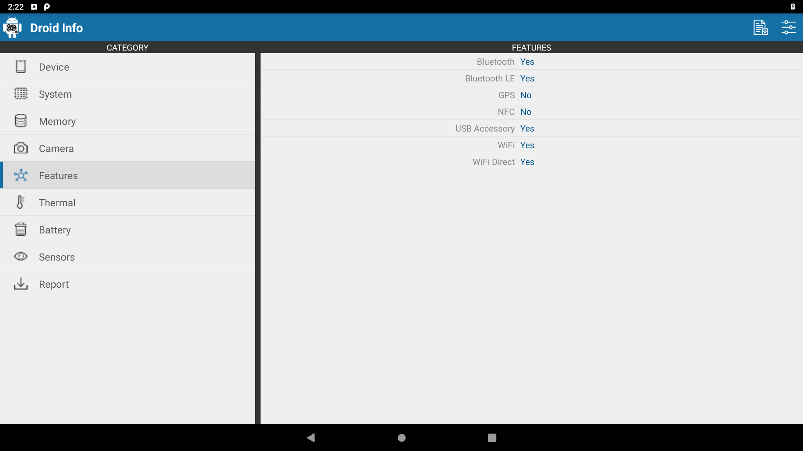

## Getting Started with MaaXboard On Android OS

***Note***: 
This repo is my quick reminder, notting is offial here.

Wellcome asking questions, corrections and giving feedback.

### How does Maaxboard(IMX8MQ6C) seems on the Android 9

* Device Info

* System Info

* Memory Info

* Features Info

