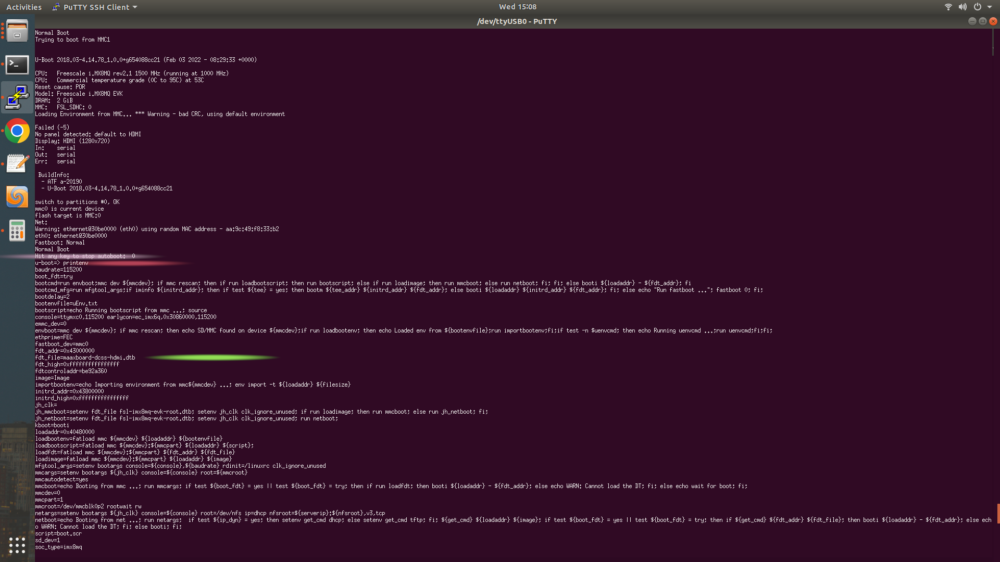

## This notes have been written considering maaxboard dev board based on IMX8MQ-EVK

CONTENT-LIST
=================
<!--ts-->
  * [ To create a new yocto-layer](#to-create-a-new-yocto-layer-run)
  * [ To see dtb file located path](#to-see-dtb-file-located-path)
  * [ To compile dts file (from dts to dtb](#to-compile-dts-file-from-dts-to-dtb)
  * [ To get dts file from dtb file](#to-get-dts-file-from-dtb-file)
  * [ To mount Hidden boot partition in order to edit uEnv.txt or dtb files](#to-mount-hidden-boot-partition-in-order-to-edit-uenvtxt-or-dtb-files)
  * [ To Print function name using by macro](#print-function-name-using-by-macro)
  * [ To Print current computer time by macro](#to-print-current-computer-time-by-macro)
  <!--* [ To see dtb file located path](#)
  * [ To see dtb file located path](#)-->
  
<!--te-->

### **To create a new yocto-layer, run** 
```bash
bitbake-layers create-layer meta-bsp-custom
```
and you need to add this layer into your conf/bblayers.conf

such as: 
```bash
BBLAYERS += " ${BSPDIR}/sources/meta-bsp-custom "
```

### **To see dtb file located path,**

during the booting you need to stop booting and run "**printenv**" command.



### **To compile dts file (from dts to dtb)**
```bash
dtc -O dtb -o maaxboard-dcss-hdmi.dtb maaxboard-dcss-hdmi.dts
```

### **To get dts file from dtb file**
```bash
dtc -I dtb -O dts maaxboard-dcss-hdmi.dtb -o maaxboard-dcss-hdmi.dts
```
### **To mount Hidden boot partition in order to edit uEnv.txt or dtb files**

execute this command:  
```bash
 fdisk -l
 ```
 And you should get some output like below
 ```
Disk /dev/mmcblk0: 29.7 GiB, 31914983424 bytes, 62333952 sectors
Units: sectors of 1 * 512 = 512 bytes
Sector size (logical/physical): 512 bytes / 512 bytes
I/O size (minimum/optimal): 512 bytes / 512 bytes
Disklabel type: dos
Disk identifier: 0x89ce7595

Device         Boot  Start      End  Sectors  Size Id Type
/dev/mmcblk0p1       16384   147455   131072   64M  c W95 FAT32 (LBA)
/dev/mmcblk0p2      147456 62333951 62186496 29.7G 83 Linux
root@maax:/mnt#

```
as you see, we need to mount **/dev/mmcblk0p1** partition to edit files in that partition

```bash
mount /dev/mmcblk0p1 /mnt
```
Thus, we mounted the partition into the **/mnt**.


### **Print function name using by macro**

i.e. we have a function call ex5_simple_module_function

```
void ex5_simple_module_function()
{
  printk(KERN_ALERT,"Inside the %s function\n",__FUNCTION__);
}
```

### **To Print current computer time by macro**

i.e. we have a function call ex5_simple_module_function

```
void printfTime()
{
  printf("Inside the %s function\n",__TIME__);
}
```

#

## Random note, might be helpful, check them out: 

to create a yocto file system from scratch. Watch this episode https://www.youtube.com/watch?v=2-PwskQrZac&list=PLEBQazB0HUyTpoJoZecRK6PpDG31Y7RPB&index=3

so I need to get ride of heavy yocto files/ plugins such as opencv, qt etc. you need to edit lite-image, bblayer in conf

try this code block

bitbake -c menuconfig virtual/kernel
