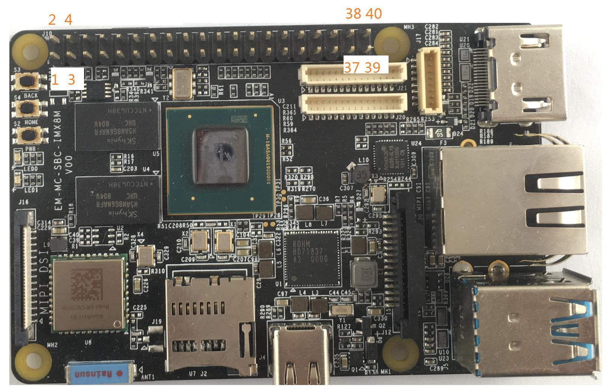

# MaaxBoard GPIO

Table of contents
=================

<!--ts-->
  * [ 40 Pin Expansion Pin Header Definition (J1O Header)](#40-pin-expansion-pin-header-definition-j1o-header)
  * [ How to calculate GPIO pin number](#how-to-calculate-gpio-pin-number)
  
<!--te-->


## 40 Pin Expansion Pin Header Definition (J1O Header)




| Maax Pin Num | Package Pin   | GPIO | Pin Name | Signal Type | 
| ------------- | ------------- | ------------- | ------------- | ------------- | 
| 1 | |  |NVCC_3V3 | Power  |  
| 2 | |  |5V_IN | Power  |  
| 3 | F7| GPIO5_IO17(GPIO5) |I2C2_SDA | IO |  
| 4 | |  |5V_IN | Power |  
| 5 | G7| GPIO5_IO16(GPIO5) |I2C2_SCL | IO |  
| 6 | |  |GND | Ground |  
| 7 | K20 | GPIO3_IO16 | NAND_READY_B | IO |  
| 8 | A7| GPIO5_IO23(GPIO5) |UART1_TXD | IO | 
| 9 | |  |GND | Ground |  
| 10 | C7| GPIO5_IO22(GPIO5) |UART1_RXD  | IO |  
| 11 | K22| GPIO3_IO17 |   | IO |  
| 12 | J5| GPIO4_IO25(GPIO4) |SAI2_TXC  | IO |  
| 13 | H22| GPIO3_IO08(GPIO3) |  | IO |  
| 14 | | |GND | Ground |  
| 15 | J21| GPIO3_IO09 |  | IO |  
| 16 | B6| GPIO5_IO24(GPIO5) |UART2_RXD  | IO  |  
| 17 | | |NVCC_3V3  | Power |  
| 18 | D6| GPIO5_IO25(GPIO5) |UART2_TXD  | IO |  
| 19 | G20| GPIO3_IO06 |  | IO |  
| 20 | | |GND  | Ground |  
| 21 | J20| GPIO3_IO07 |  | IO |  
| 22 | K19| GPIO3_IO15 |  | IO |  
| 23 | G19| GPIO3_IO00 |  | IO |  
| 24 | H19| GPIO3_IO01 |  | IO |  
| 25 | | |GND  |  |  
| 26 | G21| GPIO3_IO02|  | IO |  
| 27 | E9| GPIO5_IO19(GPIO5) |I2C3_SDA  | IO |  
| 28 | G8| GPIO5_IO18(GPIO5) |I2C3_SCL  | IO |  
| 29 | H21| GPIO3_IO05 |  | IO |  
| 30 | | |GND  | Ground |  
| 31 | L20| GPIO3_IO10 |  | IO |  
| 32 | J6| GPIO1_IO15 |  | IO |  
| 33 | K6| GPIO1_IO13 |  | IO |  
| 34 | | |GND  | Ground |  
| 35 | J4| GPIO4_IO21(GPIO4) |SAI2_RXFS  |  |  
| 36 | P4| GPIO1_IO03 |   | IO |  
| 37 | J22| GPIO3_IO11 |  | IO | 
| 38 | J4| GPIO4_IO23(GPIO4) |SAI2_RXD  | IO |  
| 39 | | |GND  | Ground |  
| 40 | G5| GPIO4_IO26(GPIO4) |SAI2_TXD  | IO |  

## How to calculate GPIO pin number: 

The GPIO pins could also be used, by calculating the gpio number as follows:
```
gpio_number = (chip_number -1) * 32 + gpio port
```
For example,
```
GPIO port 11 on gpio3 is: (3-1)*32 +11 = 75.
```
