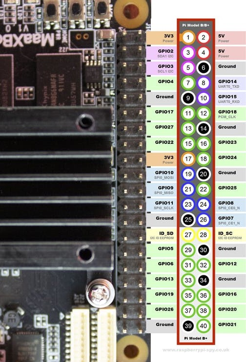

# MaaxBoard (EM-MC-SBC-IMX8M) HW V1.0 J10 GPIO PIN HEADER

Table of contents
=================

<!--ts-->
  * [ 40 Pin Expansion Pin Header Definition (J1O Header)](#40-pin-expansion-pin-header-definition-j1o-header)
  * [ How to calculate GPIO pin number](#how-to-calculate-gpio-pin-number)
  
<!--te-->


## 40 Pin Expansion Pin Header Definition (J1O Header)




| Maax Pin Num | SYS PIN NUM| Package Pin   | GPIO | Pin Name | Signal Type |
| ------------- | ------------- | ------------- | ------------- | ------------- | ------------- | 
| 1 || |  |NVCC_3V3 | Power  |  
| 2 || |  |5V_IN | Power  |  
| 3 || F7| GPIO5_IO17(GPIO5) |I2C2_SDA - (GPIO2/SDA1)H| IO | 
| 4 || |  |5V_IN | Power |  
| 5 || G7| GPIO5_IO16(GPIO5) |I2C2_SCL - (GPIO3/SCL1)H| IO | 
| 6 || |  |GND | Ground |  
| 7 || K20 | GPIO3_IO16 | NAND_READY_B / SAI2_MCLK (GPIO4_GCLK)H | IO |  
| 8 || A7| GPIO5_IO23(GPIO5) |UART1_TXD - (GPIO14/TXD0)L| IO | 
| 9 || |  |GND | Ground |  
| 10 || C7| GPIO5_IO22(GPIO5) |UART1_RXD - (GPIO15/RXD0)L| IO |  
| 11 || K22| GPIO3_IO17 |  (GPIO17_GEN0)L | IO |  
| 12 || J5| GPIO4_IO25(GPIO4) |SAI2_TXC / SAI2_RXC - (GPIO18_GEN1/PCM_CLK)| IO |  
| 13 || H22| GPIO3_IO08(GPIO3) | QSPIA_DATA2 - (GPIO27_GEN2)L| IO |
| 14 || | |GND | Ground |  
| 15 || J21| GPIO3_IO09 | QSPIA_DATA3 - (GPIO22_GEN3)L| IO |  
| 16 || B6| GPIO5_IO24(GPIO5) |UART2_RXD - (GPIO23_GEN4)L| IO  |  
| 17 || | |NVCC_3V3  | Power |  
| 18 || D6| GPIO5_IO25(GPIO5) |UART2_TXD - (GPIO24_GEN5)L| IO | 
| 19 || A4| GPIO5_IO07 | ECSPI1_MOSI / UART3_TXD - (GPIO10/SPI_MOSI)L| IO |  
| 20 || | |GND  | Ground |  
| 21 || B4| GPIO5_IO08 | ECSPI1_MISO / UART3_CTS - (GPIO9/SPI_MISO)L| IO |  
| 22 || K19| GPIO3_IO15 |  (GPIO25_GEN6)L| IO |  
| 23 || D5| GPIO5_IO06 | ECSPI1_SCLK / UART3_RXD - (GPIO11/SPI_SCLK)L| IO |  
| 24 || D4| GPIO5_IO09 | ECSPI1_SS0 / UART3_RTS - (GPIO8/SPI_CE0_N)H| IO |  
| 25 || | |GND  |  |  
| 26 || G21| GPIO3_IO02| QSPIA_nSS1 - (GPIO7/SPI_CE1_N)H| IO |  
| 27 || E9| GPIO5_IO19(GPIO5) |I2C3_SDA - (GPIO0/ID_SD)H| IO |
| 28 || G8| GPIO5_IO18(GPIO5) |I2C3_SCL - (GPIO1/ID_SC)H| IO |
| 29 || H21| GPIO3_IO05 | - (GPIO5_GPCLK)H| IO |  
| 30 || | |GND  | Ground |  
| 31 || L20| GPIO3_IO10 | - (GPIO6_GPCLK)H| IO |  
| 32 || J6| GPIO1_IO15 | - (GPIO12/PWM0)L| IO |  MX8MQ_IOMUXC_GPIO1_IO15_PWM4_OUT |
| 33 || K6| GPIO1_IO13 | - (GPIO13/PWM1)L| IO |  MX8MQ_IOMUXC_GPIO1_IO13_PWM2_OUT |
| 34 || | |GND  | Ground |  
| 35 || J4| GPIO4_IO21(GPIO4) |SAI2_RXFS / SAI2_TXFS - (GPIO19/PCM_FS)L | IO |  
| 36 |3| P4| GPIO1_IO03 | -  (GPIO16)L| IO |  
| 37 |75| J22| GPIO3_IO11 | - (GPIO26)L| IO | 
| 38 |119| J4| GPIO4_IO23(GPIO4) |SAI2_RXD - (GPIO20/PCM_DIN)L| IO | 
| 39 || | |GND  | Ground |  
| 40 |122| G5| GPIO4_IO26(GPIO4) |SAI2_TXD - (GPIO21/PCM_DOUT)L| IO |  

## How to calculate GPIO pin number: 


The GPIO pins could also be used, by calculating the gpio number as follows:
```
gpio_number = (chip_number -1) * 32 + gpio port
```
For example,
```
GPIO port 11 on gpio3 is: (3-1)*32 +11 = 75.
```
