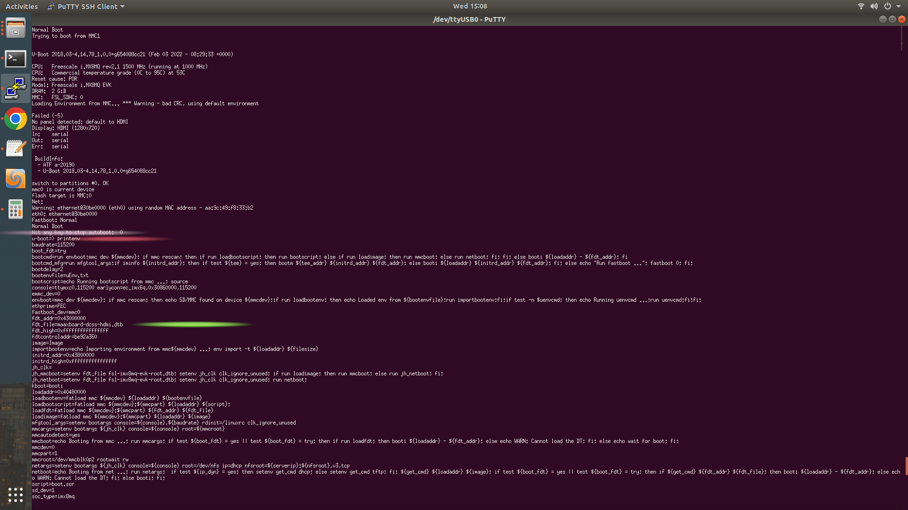

##This notes have been written considering maaxboard dev board based on IMX8MQ-EVK


* **To create a new yocto-layer, run** 
```bash
bitbake-layers create-layer meta-bsp-custom
```
and you need to add this layer into your conf/bblayers.conf

such as: 
```bash
BBLAYERS += " ${BSPDIR}/sources/meta-bsp-custom "
```

* **To see dtb file located path,**

during the booting you need to stop booting and run "**printenv**" command.



* **To compile dts file (from dts to dtb)**
```bash
dtc -O dtb -o maaxboard-dcss-hdmi.dtb maaxboard-dcss-hdmi.dts
```

* **To get from dtb file to dts file**
```bash
dtc -I dtb -O dts maaxboard-dcss-hdmi.dtb -o maaxboard-dcss-hdmi.dts
```


**---------------------------------------------------------**

## Random note, might be helpful, check them out: 

to create a yocto file system from scratch. Watch this episode https://www.youtube.com/watch?v=2-PwskQrZac&list=PLEBQazB0HUyTpoJoZecRK6PpDG31Y7RPB&index=3

so I need to get ride of heavy yocto files/ plugins such as opencv, qt etc. you need to edit lite-image, bblayer in conf

try this code block

bitbake -c menuconfig virtual/kernel
